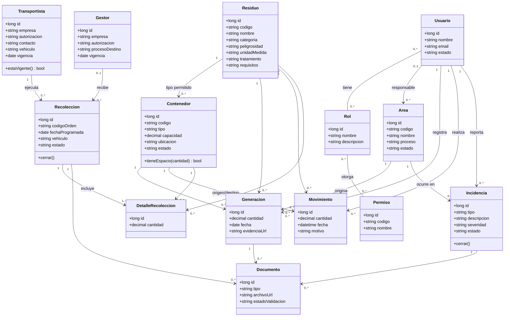

# Diagrama de clases — EcoAndina

Corresponde a la sección **3.2.2 Diseño de clases** del informe.

Catorce clases de dominio agrupadas en control de acceso (Usuario, Rol, Permiso), catálogos
(Área, Residuo, Contenedor, Transportista, Gestor) y operación (Generación, Movimiento,
Recolección, DetalleRecoleccion, Incidencia, Documento). Ver
[docs/modelo-entidad-relacion.md](modelo-entidad-relacion.md) para el mapeo a tablas y las
decisiones de simplificación (no está normalizado a 3FN a propósito, salvo roles/permisos).

## Responsabilidad de cada clase

| Clase | Responsabilidad |
|---|---|
| `Usuario` | Cuenta de acceso; puede tener varios `Rol` y referencia opcional a Área, Transportista o Gestor |
| `Rol` | Perfil de acceso (Generador, Supervisor, Administrador…); agrupa uno o varios `Permiso` |
| `Permiso` | Acción concreta autorizable (ej. validar generación, cerrar incidencia); reutilizable entre roles |
| `Area` | Área generadora de residuos (producción, mantenimiento, almacén…) |
| `Residuo` | Catálogo de tipos de residuo, su peligrosidad y requisitos de manejo |
| `Contenedor` | Punto de acopio físico; admite un único tipo de residuo |
| `Generacion` | Registro de residuo generado: cuánto, dónde, cuándo, por quién |
| `Movimiento` | Traslado interno de residuo entre contenedores |
| `Transportista` | Empresa autorizada de transporte externo |
| `Gestor` | Empresa autorizada de tratamiento/disposición final |
| `Recoleccion` | Orden de retiro: agenda, transportista, gestor, vehículo del viaje y su estado |
| `DetalleRecoleccion` | Línea de una recolección: qué contenedor/residuo y cuánta cantidad |
| `Incidencia` | Derrame, mezcla, retraso o rechazo, con severidad y cierre |
| `Documento` | Manifiesto, constancia o evidencia adjunta a otra entidad |

## Nota sobre roles y permisos

`Usuario` – `Rol` y `Rol` – `Permiso` son relaciones muchos-a-muchos reales (no un campo de
texto): un usuario puede tener varios roles, y un rol agrupa varios permisos. Es la única
parte del modelo que sí se normaliza — ver
[docs/modelo-entidad-relacion.md](modelo-entidad-relacion.md#por-qué-no-está-normalizado-a-3fn).
