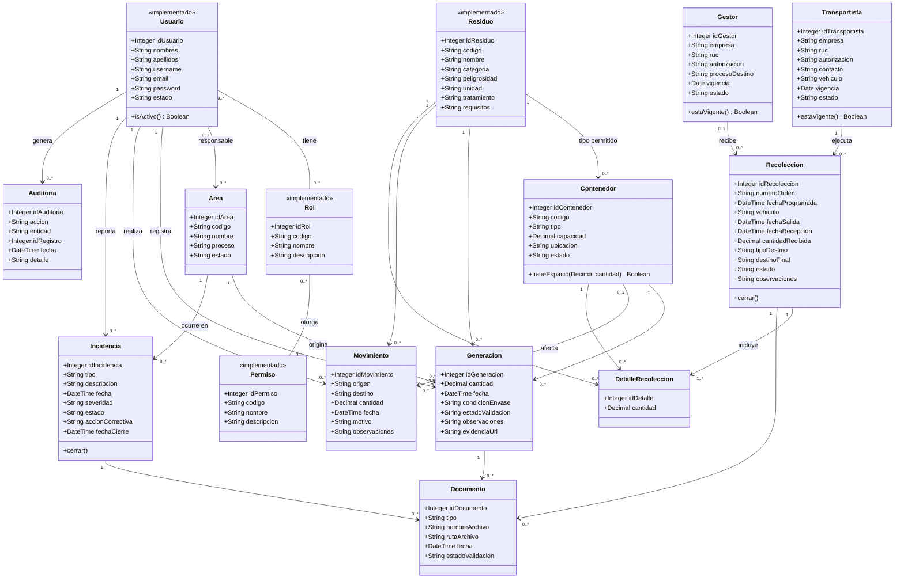

# Diagrama de clases — EcoAndina

Corresponde a la sección **3.2.2 Diseño de clases** del informe.

Quince clases de dominio agrupadas en control de acceso (`Usuario`, `Rol`, `Permiso`), catálogos
(`Area`, `Residuo`, `Contenedor`, `Transportista`, `Gestor`) y operación (`Generacion`, `Movimiento`,
`Recoleccion`, `DetalleRecoleccion`, `Incidencia`, `Documento`, `Auditoria`).

Las clases marcadas `<<implementado>>` ya existen en el backend; el resto es el diseño de los módulos
pendientes. Ver [modelo-entidad-relacion.md](modelo-entidad-relacion.md) para las tablas, el estado de
implementación y las decisiones de simplificación (no está normalizado a 3FN a propósito, salvo roles y
permisos), y [roles-y-permisos.md](roles-y-permisos.md) para la matriz de acceso.

## Responsabilidad de cada clase

| Clase | Estado | Responsabilidad |
|---|---|---|
| `Usuario` | implementado | Cuenta de acceso; puede tener varios `Rol` |
| `Rol` | implementado | Perfil de acceso (Generador, Supervisor, Administrador…); agrupa uno o varios `Permiso` |
| `Permiso` | implementado | Acción concreta autorizable (ej. validar generación, cerrar incidencia); reutilizable entre roles |
| `Residuo` | implementado | Catálogo de tipos de residuo, su peligrosidad y requisitos de manejo |
| `Area` | pendiente | Área generadora de residuos (producción, mantenimiento, almacén…) |
| `Contenedor` | pendiente | Punto de acopio físico; admite un único tipo de residuo |
| `Generacion` | pendiente | Registro de residuo generado: cuánto, dónde, cuándo, por quién y si ya fue validado |
| `Movimiento` | pendiente | Traslado interno de residuo entre áreas o zonas (origen → destino) |
| `Transportista` | pendiente | Empresa autorizada de transporte externo |
| `Gestor` | pendiente | Empresa autorizada de tratamiento o disposición final |
| `Recoleccion` | pendiente | Orden de retiro: agenda, transportista, vehículo, recepción y destino, y su estado |
| `DetalleRecoleccion` | pendiente | Línea de una recolección: qué contenedor/residuo y cuánta cantidad |
| `Incidencia` | pendiente | Derrame, mezcla, retraso o rechazo, con severidad, acción correctiva y cierre |
| `Documento` | pendiente | Manifiesto, constancia o evidencia adjunta a otra entidad |
| `Auditoria` | pendiente | Registro de quién validó, modificó o cerró qué y cuándo |

## Diferencias con el diagrama de clases del informe

El informe (`avance1.docx`, sección 3.2.2) tiene su propio diagrama, más detallado. Este es una versión
simplificada; las diferencias son:

- **Vehículo**: aquí es un texto en `Transportista` y `Recoleccion`; el informe (RF009) tiene una clase
  `Vehiculo` con placa, tipo, capacidad y estado.
- **Recepción y destino**: aquí son atributos de `Recoleccion` (`fechaRecepcion`, `cantidadRecibida`,
  `tipoDestino`, `destinoFinal`); el informe (RF012) los separa en las clases `Recepcion` y `Destino`.
- **Evidencia**: aquí es `evidenciaUrl` en `Generacion` más la clase `Documento`; el informe tiene una
  clase `Evidencia`.
- **Roles y permisos**: el informe relaciona cada usuario con un solo rol y no tiene `Permiso`; aquí un
  usuario puede tener varios roles y un rol varios permisos.
