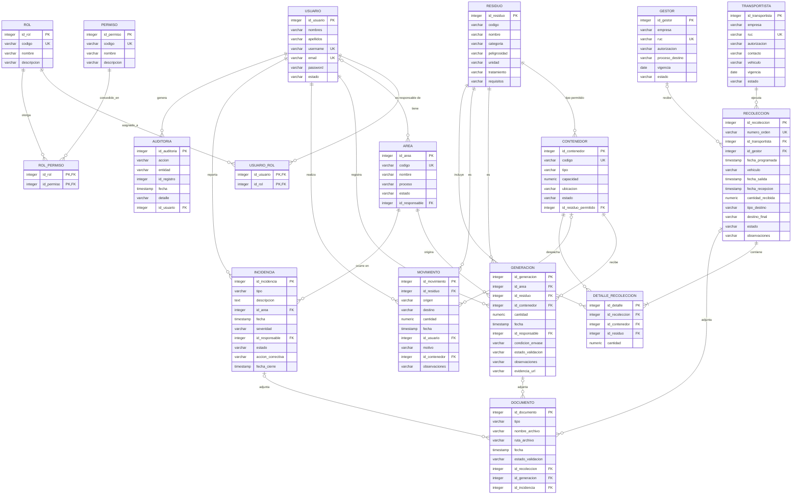

# Modelo entidad-relación — EcoAndina

Corresponde a la sección **3.2.3.1 Modelo entidad relación** del informe. Es el mapeo a tablas
PostgreSQL del [diagrama de clases](diagrama-clases.md). Los permisos y roles iniciales están en
[roles-y-permisos.md](roles-y-permisos.md).

## Estado de implementación

| Tabla | Estado | Entidad JPA |
|---|---|---|
| `usuario` | implementado | `Usuario` |
| `rol` | implementado | `Rol` |
| `permiso` | implementado | `Permiso` |
| `usuario_rol` | implementado | (@ManyToMany de Usuario) |
| `rol_permiso` | implementado | (@ManyToMany de Rol) |
| `residuo` | implementado | `Residuo` |
| `area`, `contenedor`, `generacion`, `movimiento`, `transportista`, `gestor`, `recoleccion`, `detalle_recoleccion`, `incidencia`, `documento`, `auditoria` | pendiente | — |

Las tablas se crean desde las entidades JPA (`spring.jpa.hibernate.ddl-auto=update`), así que el esquema
real es el que definen esas clases. La entidad `Residuo` no define longitudes ni restricciones: hoy todas
sus columnas son `varchar(255)` y opcionales.

## Convenciones

- Clave primaria `id_<entidad>` de tipo `integer` con identidad autogenerada.
- Una clave foránea se llama igual que la clave que referencia (`id_area`, `id_residuo`…); si la relación
  tiene un rol propio se nombra por el rol (`id_responsable`, `id_residuo_permitido`).
- Las tablas puente (`usuario_rol`, `rol_permiso`) no tienen id propio: su clave primaria es compuesta.
- Nombres en `snake_case`; los valores de estado y tipo son texto en mayúsculas (`ACTIVO`, `EN_TRANSITO`…).

## Por qué no está normalizado a 3FN

Se optó por un modelo relacional directo en vez de perseguir 3FN estricta: menos tablas puente, menos
joins y un esquema que se explica solo. Decisiones concretas:

1. **Un residuo permitido por contenedor**: `contenedor.id_residuo_permitido` en vez de una tabla puente
   N:N `contenedor_residuo`.
2. **Vehículo como texto**: `transportista.vehiculo` y `recoleccion.vehiculo` (el vehículo de ese viaje)
   en vez de una entidad `vehiculo` con placa, tipo, capacidad y estado (RF009).
3. **`documento` con tres FK opcionales** (`id_recoleccion`, `id_generacion`, `id_incidencia`) en vez de
   una tabla de adjuntos polimórfica genérica.
4. **Evidencia liviana en `generacion.evidencia_url`**: la foto de segregación no siempre necesita pasar
   por `documento`.
5. **Recepción y destino dentro de `recoleccion`**: `fecha_recepcion`, `cantidad_recibida`, `tipo_destino`
   y `destino_final` en vez de entidades `recepcion` y `destino` separadas (RF012).
6. **`movimiento` no referencia la `generacion` de origen**: la trazabilidad se sigue por residuo,
   ruta (`origen` → `destino`) y fecha, no a nivel de lote individual.

**Excepción, roles y permisos**: es la única relación M:N del modelo y es intencional. Un usuario puede
tener varios roles y un rol varios permisos, así que `usuario_rol` y `rol_permiso` son tablas puente
reales, no un exceso de normalización.

## Decisiones abiertas

- **Vincular usuarios con su organización**: hoy `usuario` no referencia un área, transportista o gestor.
  Un usuario con rol Transportista o Gestor autorizado ve lo mismo que cualquier otro con ese rol; si debe
  ver solo lo de su empresa habrá que agregar esa referencia.
- **Entidades separadas del informe**: `vehiculo`, `recepcion`, `destino` y `evidencia` (ver las
  decisiones 2, 3 y 5).
- **Restricciones de `residuo`**: definir longitudes y un `codigo` único, como en el resto de catálogos.
- **Cómo se llena `auditoria`**: quién escribe los registros (servicio o interceptor) al validar, modificar
  o cerrar.

## Diagrama

`movimiento` solo lleva un vínculo opcional con `contenedor` (`id_contenedor`), que sirve para controlar la
capacidad, porque su origen y su destino son rutas en texto (por ejemplo, Mantenimiento → Patio de
residuos).

## Diccionario de datos

### usuario — Cuenta de acceso al sistema

Estado: **implementado** (`Usuario`)

| Atributo | Tipo | Nota |
|---|---|---|
| id_usuario (PK) | integer | identidad autogenerada |
| nombres | varchar(100) |  |
| apellidos | varchar(100) |  |
| username (UK) | varchar(50) | único; sirve para iniciar sesión |
| email (UK) | varchar(120) | único; también sirve para iniciar sesión |
| password | varchar(100) | hash BCrypt, nunca en claro |
| estado | varchar(15) | ACTIVO / INACTIVO (por defecto ACTIVO); un usuario INACTIVO no puede ingresar |

### rol — Perfil de acceso (catálogo)

Estado: **implementado** (`Rol`)

| Atributo | Tipo | Nota |
|---|---|---|
| id_rol (PK) | integer | identidad autogenerada |
| codigo (UK) | varchar(40) | único, ej. SUPERVISOR_AMBIENTAL; en el JWT se usa como ROLE_<codigo> |
| nombre | varchar(60) | nombre para mostrar, ej. Supervisor ambiental |
| descripcion | varchar(200) | opcional |

### permiso — Acción autorizable (catálogo)

Estado: **implementado** (`Permiso`)

| Atributo | Tipo | Nota |
|---|---|---|
| id_permiso (PK) | integer | identidad autogenerada |
| codigo (UK) | varchar(60) | único, ej. INCIDENCIA_GESTIONAR; en el JWT se usa tal cual |
| nombre | varchar(100) |  |
| descripcion | varchar(200) | opcional |

### usuario_rol — Tabla puente: roles de un usuario

Estado: **implementado** (@ManyToMany de Usuario)

| Atributo | Tipo | Nota |
|---|---|---|
| id_usuario (PK, FK) | integer | → usuario |
| id_rol (PK, FK) | integer | → rol |

### rol_permiso — Tabla puente: permisos de un rol

Estado: **implementado** (@ManyToMany de Rol)

| Atributo | Tipo | Nota |
|---|---|---|
| id_rol (PK, FK) | integer | → rol |
| id_permiso (PK, FK) | integer | → permiso |

### residuo — Catálogo de tipos de residuo

Estado: **implementado** (`Residuo`)

| Atributo | Tipo | Nota |
|---|---|---|
| id_residuo (PK) | integer | identidad autogenerada |
| codigo | varchar(255) | ej. RES-001 |
| nombre | varchar(255) |  |
| categoria | varchar(255) | Comunes / Aprovechables / Peligrosos / Biocontaminados (según los mockups) |
| peligrosidad | varchar(255) |  |
| unidad | varchar(255) | kg / L / unid |
| tratamiento | varchar(255) | ej. Reciclaje, Incineración controlada |
| requisitos | varchar(255) | condiciones de almacenamiento y manejo |

### area — Área generadora de residuos

Estado: pendiente

| Atributo | Tipo | Nota |
|---|---|---|
| id_area (PK) | integer |  |
| codigo (UK) | varchar(20) | único |
| nombre | varchar(100) |  |
| proceso | varchar(100) |  |
| estado | varchar(15) | ACTIVA / INACTIVA |
| id_responsable (FK) | integer | → usuario; opcional |

### contenedor — Punto de acopio físico

Estado: pendiente

| Atributo | Tipo | Nota |
|---|---|---|
| id_contenedor (PK) | integer |  |
| codigo (UK) | varchar(20) | único, ej. CT-104 |
| tipo | varchar(50) | ej. Cilindro 200 L, Jaula metálica |
| capacidad | numeric(8,2) |  |
| ubicacion | varchar(100) |  |
| estado | varchar(15) | DISPONIBLE / LLENO / BAJA |
| id_residuo_permitido (FK) | integer | → residuo (un solo tipo por contenedor) |

### generacion — Residuo generado y registrado

Estado: pendiente

| Atributo | Tipo | Nota |
|---|---|---|
| id_generacion (PK) | integer |  |
| id_area (FK) | integer | → area |
| id_residuo (FK) | integer | → residuo |
| id_contenedor (FK) | integer | → contenedor |
| cantidad | numeric(8,2) |  |
| fecha | timestamp |  |
| id_responsable (FK) | integer | → usuario |
| condicion_envase | varchar(50) | ej. Íntegro, Dañado |
| estado_validacion | varchar(15) | PENDIENTE / VALIDADA / OBSERVADA (la valida el supervisor) |
| observaciones | varchar(255) | opcional |
| evidencia_url | varchar(255) | opcional |

### movimiento — Traslado interno de residuo

Estado: pendiente

| Atributo | Tipo | Nota |
|---|---|---|
| id_movimiento (PK) | integer |  |
| id_residuo (FK) | integer | → residuo |
| origen | varchar(100) | ej. Mantenimiento |
| destino | varchar(100) | ej. Patio de residuos |
| cantidad | numeric(8,2) |  |
| fecha | timestamp |  |
| id_usuario (FK) | integer | → usuario |
| motivo | varchar(100) |  |
| id_contenedor (FK) | integer | → contenedor afectado, para el control de capacidad; opcional |
| observaciones | varchar(255) | opcional |

### transportista — Empresa de transporte externo

Estado: pendiente

| Atributo | Tipo | Nota |
|---|---|---|
| id_transportista (PK) | integer |  |
| empresa | varchar(120) |  |
| ruc (UK) | varchar(11) | único |
| autorizacion | varchar(60) |  |
| contacto | varchar(100) | teléfono / correo |
| vehiculo | varchar(60) | placa y tipo, texto simple |
| vigencia | date | autorización vigente hasta |
| estado | varchar(15) | ACTIVO / SUSPENDIDO |

### gestor — Empresa de tratamiento o disposición final

Estado: pendiente

| Atributo | Tipo | Nota |
|---|---|---|
| id_gestor (PK) | integer |  |
| empresa | varchar(120) |  |
| ruc (UK) | varchar(11) | único |
| autorizacion | varchar(60) |  |
| proceso_destino | varchar(100) | reciclaje, relleno, incineración… |
| vigencia | date | autorización vigente hasta |
| estado | varchar(15) | ACTIVO / SUSPENDIDO |

### recoleccion — Orden de recolección

Estado: pendiente

| Atributo | Tipo | Nota |
|---|---|---|
| id_recoleccion (PK) | integer |  |
| numero_orden (UK) | varchar(30) | único, ej. OR-1042 |
| id_transportista (FK) | integer | → transportista |
| id_gestor (FK) | integer | → gestor; opcional hasta la recepción |
| fecha_programada | timestamp |  |
| vehiculo | varchar(60) | vehículo usado en este viaje |
| fecha_salida | timestamp | opcional |
| fecha_recepcion | timestamp | opcional |
| cantidad_recibida | numeric(8,2) | la confirma el gestor; opcional |
| tipo_destino | varchar(30) | TRATAMIENTO / VALORIZACION / DISPOSICION; opcional |
| destino_final | varchar(100) | opcional |
| estado | varchar(20) | PENDIENTE / PROGRAMADA / EN_TRANSITO / RECIBIDA / CERRADA |
| observaciones | varchar(255) | opcional |

### detalle_recoleccion — Línea de una recolección

Estado: pendiente

| Atributo | Tipo | Nota |
|---|---|---|
| id_detalle (PK) | integer |  |
| id_recoleccion (FK) | integer | → recoleccion |
| id_contenedor (FK) | integer | → contenedor |
| id_residuo (FK) | integer | → residuo |
| cantidad | numeric(8,2) |  |

### incidencia — Derrame, mezcla, retraso o rechazo

Estado: pendiente

| Atributo | Tipo | Nota |
|---|---|---|
| id_incidencia (PK) | integer |  |
| tipo | varchar(20) | DERRAME / MEZCLA / ENVASE_DAÑADO / RETRASO / RECHAZO |
| descripcion | text |  |
| id_area (FK) | integer | → area |
| fecha | timestamp |  |
| severidad | varchar(15) | BAJA / MEDIA / ALTA |
| id_responsable (FK) | integer | → usuario |
| estado | varchar(15) | ABIERTA / EN_REVISION / CERRADA |
| accion_correctiva | varchar(255) | opcional |
| fecha_cierre | timestamp | opcional |

### documento — Manifiesto, constancia o evidencia

Estado: pendiente

| Atributo | Tipo | Nota |
|---|---|---|
| id_documento (PK) | integer |  |
| tipo | varchar(20) | MANIFIESTO / EVIDENCIA / CONSTANCIA |
| nombre_archivo | varchar(150) |  |
| ruta_archivo | varchar(255) |  |
| fecha | timestamp |  |
| estado_validacion | varchar(15) | PENDIENTE / VALIDADO |
| id_recoleccion (FK) | integer | → recoleccion; opcional |
| id_generacion (FK) | integer | → generacion; opcional |
| id_incidencia (FK) | integer | → incidencia; opcional |

### auditoria — Registro de acciones (RF016)

Estado: pendiente

| Atributo | Tipo | Nota |
|---|---|---|
| id_auditoria (PK) | integer |  |
| accion | varchar(30) | CREAR / MODIFICAR / VALIDAR / CERRAR… |
| entidad | varchar(50) | tabla afectada |
| id_registro | integer | registro afectado |
| fecha | timestamp |  |
| detalle | varchar(500) | opcional |
| id_usuario (FK) | integer | → usuario (responsable de la acción) |
