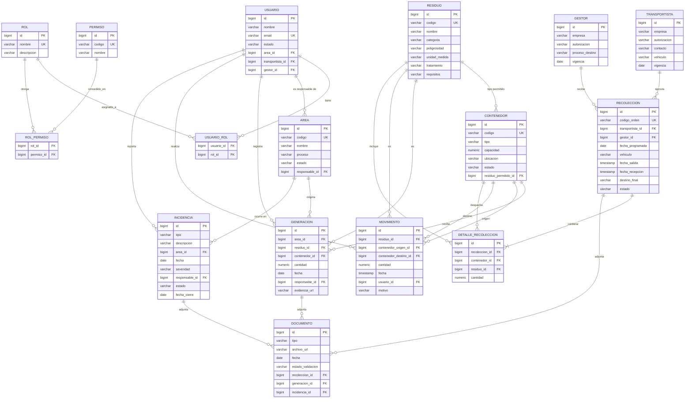

# Modelo entidad-relación — EcoAndina

Corresponde a la sección **3.2.3.1 Modelo entidad relación** del informe. Mapeo directo del
[diagrama de clases](diagrama-clases.md) a tablas PostgreSQL.

## Por qué no está normalizado a 3FN

Se optó por un modelo relacional directo en vez de perseguir 3FN estricta: menos tablas
puente, menos joins, y un esquema que se explica solo. Decisiones concretas:

1. **Un residuo permitido por contenedor** — `contenedor.residuo_permitido_id` en vez de una
   tabla puente N:N `contenedor_residuo`.
2. **Vehículo como texto en `transportista`** — sin entidad `vehiculo` con placa,
   mantenimiento o historial propio. `recoleccion.vehiculo` guarda el vehículo usado en ese
   viaje puntual (puede diferir del vehículo por defecto del transportista).
3. **`documento` con tres FK opcionales** (`recoleccion_id`, `generacion_id`,
   `incidencia_id`) en vez de una tabla de adjuntos polimórfica genérica.
4. **Evidencia liviana en `generacion.evidencia_url`** — la foto de segregación no siempre
   necesita pasar por `documento`.
5. **Transporte y recepción como estados de la misma `recoleccion`** — no existe una entidad
   `recepcion` separada; son fechas y un campo `estado`.
6. **`movimiento` no referencia la `generacion` de origen** — la trazabilidad se sigue por
   residuo + contenedor + fecha, no a nivel de lote individual.

**Excepción — roles y permisos:** esta es la única relación M:N del modelo, y es
intencional: un usuario puede tener varios roles y un rol varios permisos, así que
`usuario_rol` y `rol_permiso` son tablas puente reales, no un exceso de normalización.

## Diagrama

`contenedor` aparece dos veces en `movimiento` (origen/destino) — misma tabla, dos roles
distintos, sin duplicar la entidad.

## Diccionario de datos

### usuario — cuenta de acceso al sistema
| Atributo | Tipo | Nota |
|---|---|---|
| id (PK) | bigint | |
| nombre | varchar(120) | |
| email | varchar(160) | único, login |
| password_hash | varchar(255) | bcrypt |
| estado | varchar(15) | ACTIVO / INACTIVO |
| area_id (FK) | bigint | → area, nulo si no aplica |
| transportista_id (FK) | bigint | → transportista, nulo si no aplica |
| gestor_id (FK) | bigint | → gestor, nulo si no aplica |

### rol — perfil de acceso (catálogo)
| Atributo | Tipo | Nota |
|---|---|---|
| id (PK) | bigint | |
| nombre | varchar(40) | único · ej. GENERADOR, ADMIN |
| descripcion | varchar(150) | |

### permiso — acción autorizable (catálogo)
| Atributo | Tipo | Nota |
|---|---|---|
| id (PK) | bigint | |
| codigo | varchar(60) | único · ej. INCIDENCIA_CERRAR |
| nombre | varchar(100) | |

### usuario_rol — tabla puente (roles de un usuario)
| Atributo | Tipo | Nota |
|---|---|---|
| usuario_id (PK, FK) | bigint | → usuario |
| rol_id (PK, FK) | bigint | → rol |

### rol_permiso — tabla puente (permisos de un rol)
| Atributo | Tipo | Nota |
|---|---|---|
| rol_id (PK, FK) | bigint | → rol |
| permiso_id (PK, FK) | bigint | → permiso |

### area — área generadora de residuos
| Atributo | Tipo | Nota |
|---|---|---|
| id (PK) | bigint | |
| codigo | varchar(20) | único |
| nombre | varchar(100) | |
| proceso | varchar(100) | |
| estado | varchar(15) | ACTIVA / INACTIVA |
| responsable_id (FK) | bigint | → usuario, nulo |

### residuo — catálogo de tipos de residuo
| Atributo | Tipo | Nota |
|---|---|---|
| id (PK) | bigint | |
| codigo | varchar(20) | único |
| nombre | varchar(100) | |
| categoria | varchar(20) | COMUN / APROVECHABLE / PELIGROSO / BIOCONTAMINADO |
| peligrosidad | varchar(50) | corrosivo, inflamable, tóxico… |
| unidad_medida | varchar(10) | kg / l / ud |
| tratamiento | varchar(100) | |
| requisitos | varchar(150) | condiciones de almacenamiento/manejo |

### contenedor — punto de acopio físico
| Atributo | Tipo | Nota |
|---|---|---|
| id (PK) | bigint | |
| codigo | varchar(20) | único |
| tipo | varchar(50) | |
| capacidad | numeric(8,2) | |
| ubicacion | varchar(100) | |
| estado | varchar(15) | DISPONIBLE / LLENO / BAJA |
| residuo_permitido_id (FK) | bigint | → residuo |

### generacion — residuo generado y registrado
| Atributo | Tipo | Nota |
|---|---|---|
| id (PK) | bigint | |
| area_id (FK) | bigint | → area |
| residuo_id (FK) | bigint | → residuo |
| contenedor_id (FK) | bigint | → contenedor |
| cantidad | numeric(8,2) | |
| fecha | date | |
| responsable_id (FK) | bigint | → usuario |
| evidencia_url | varchar(255) | opcional |

### movimiento — traslado entre contenedores
| Atributo | Tipo | Nota |
|---|---|---|
| id (PK) | bigint | |
| residuo_id (FK) | bigint | → residuo |
| contenedor_origen_id (FK) | bigint | → contenedor |
| contenedor_destino_id (FK) | bigint | → contenedor |
| cantidad | numeric(8,2) | |
| fecha | timestamp | |
| usuario_id (FK) | bigint | → usuario |
| motivo | varchar(100) | |

### transportista — empresa de transporte externo
| Atributo | Tipo | Nota |
|---|---|---|
| id (PK) | bigint | |
| empresa | varchar(120) | |
| autorizacion | varchar(60) | |
| contacto | varchar(100) | teléfono / correo |
| vehiculo | varchar(60) | placa/tipo, texto simple |
| vigencia | date | |

### gestor — empresa de tratamiento/disposición
| Atributo | Tipo | Nota |
|---|---|---|
| id (PK) | bigint | |
| empresa | varchar(120) | |
| autorizacion | varchar(60) | |
| proceso_destino | varchar(100) | reciclaje/relleno/incineración… |
| vigencia | date | |

### recoleccion — orden de retiro
| Atributo | Tipo | Nota |
|---|---|---|
| id (PK) | bigint | |
| codigo_orden | varchar(30) | único |
| transportista_id (FK) | bigint | → transportista |
| gestor_id (FK) | bigint | → gestor, opcional |
| fecha_programada | date | |
| vehiculo | varchar(60) | vehículo usado en este viaje |
| fecha_salida | timestamp | opcional |
| fecha_recepcion | timestamp | opcional |
| destino_final | varchar(100) | opcional |
| estado | varchar(20) | PROGRAMADA / EN_TRANSITO / RECIBIDA / CERRADA |

### detalle_recoleccion — línea de una recolección
| Atributo | Tipo | Nota |
|---|---|---|
| id (PK) | bigint | |
| recoleccion_id (FK) | bigint | → recoleccion |
| contenedor_id (FK) | bigint | → contenedor |
| residuo_id (FK) | bigint | → residuo |
| cantidad | numeric(8,2) | |

### incidencia — derrame, mezcla, retraso, rechazo
| Atributo | Tipo | Nota |
|---|---|---|
| id (PK) | bigint | |
| tipo | varchar(20) | DERRAME / MEZCLA / ENVASE_DAÑADO / RETRASO / RECHAZO |
| descripcion | text | |
| area_id (FK) | bigint | → area |
| fecha | date | |
| severidad | varchar(15) | BAJA / MEDIA / ALTA |
| responsable_id (FK) | bigint | → usuario |
| estado | varchar(15) | ABIERTA / CERRADA |
| fecha_cierre | date | opcional |

### documento — manifiesto, constancia o evidencia
| Atributo | Tipo | Nota |
|---|---|---|
| id (PK) | bigint | |
| tipo | varchar(20) | MANIFIESTO / EVIDENCIA / CONSTANCIA |
| archivo_url | varchar(255) | |
| fecha | date | |
| estado_validacion | varchar(15) | PENDIENTE / VALIDADO |
| recoleccion_id (FK) | bigint | opcional |
| generacion_id (FK) | bigint | opcional |
| incidencia_id (FK) | bigint | opcional |
